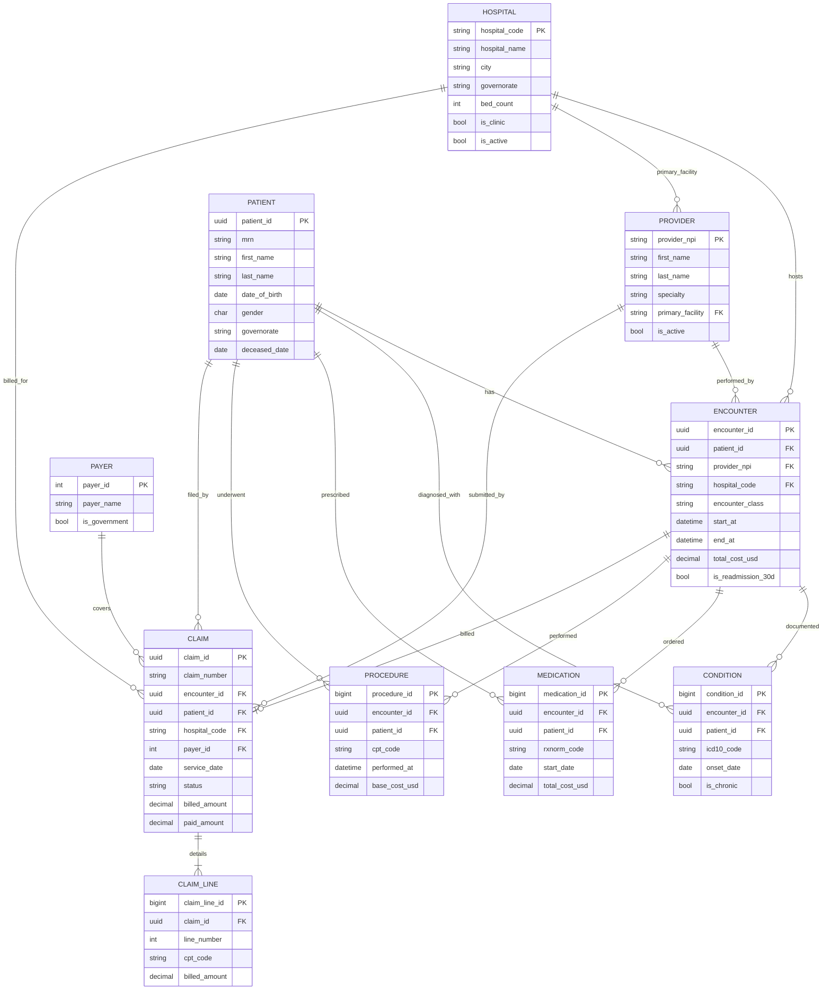

# OLTP Source - ER Diagram

This is the source operational model that feeds the Bronze layer. The
warehouse star schema (Gold) is in `er_diagram_warehouse.md`.

*Rendered PNG (above) of the Mermaid source (below).*

## Notes

* `claim.encounter_id` and `claim.patient_id` are **soft FKs**. Real claim
  feeds frequently arrive before the matching encounter has finished
  posting, so we accept orphans and surface the unmatched rate as a Silver
  data-quality KPI rather than rejecting at insert time.
* `encounter.provider_npi` is nullable in the source because Synthea doesn't
  always emit a provider; the Silver layer joins to the provider API to
  fill the gap before the Gold dimension is built.
* All clinical tables carry both `encounter_id` and `patient_id` for query
  ergonomics - it lets analysts filter by patient without a join.
