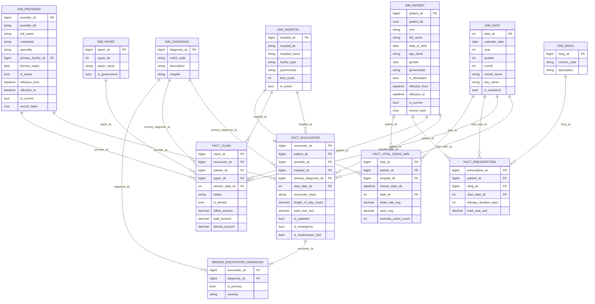

# Warehouse - Star Schema (Gold)

This is the Synapse / Power BI-facing model. Source-system grain is in
`er_diagram_oltp.md`. Bronze and Silver layers are flat copies and cleaned
versions of these same tables; the model below is the analytical contract.

*Rendered PNG (above) of the Mermaid source (below).*

## Distribution and storage choices (Synapse dedicated SQL pool)

| Table                       | Distribution     | Reason |
|-----------------------------|------------------|--------|
| dim_date                    | REPLICATE        | Tiny, joined on every query |
| dim_patient                 | HASH(patient_sk) | Largest dimension |
| dim_provider, dim_hospital, dim_payer, dim_diagnosis, dim_drug | REPLICATE | Small enough |
| fact_encounter              | HASH(patient_sk) | Co-locates with dim_patient |
| fact_claim                  | HASH(encounter_sk) | Most joins go through encounter |
| fact_prescription           | HASH(patient_sk) | Patient-centric analytics |
| fact_vital_signs_minute     | HASH(patient_sk), PARTITION(date_sk RANGE RIGHT) | Heaviest fact, partitioned by quarter |
| bridge_encounter_diagnosis  | HASH(encounter_sk) | Co-located with fact_encounter |

All facts and dimensions use **clustered columnstore** indexes - the working
load is analytical scans, not point-lookups.

## SCD2 mechanics

`dim_patient` and `dim_provider` track history via three columns:

| Column         | Meaning                                            |
|----------------|----------------------------------------------------|
| effective_from | When this row became current (UTC).                |
| effective_to   | When the row was superseded. NULL on the live row. |
| is_current     | Convenience flag, redundant with effective_to.     |

The merge logic (`sp_merge_dim_patient_scd2`) uses a SHA-256 hash over the
SCD2 attribute set. Hash mismatch -> close current row + insert new version.
Reporting views always filter `is_current = 1`; if you need point-in-time
reporting, join on `start_date BETWEEN effective_from AND ISNULL(effective_to, '9999-12-31')`.

## Date dimension range

`dim_date` is populated from **2018-01-01 through 2030-12-31**. That's 8 years
of history (matching Synthea's `generate.years_of_history = 8`) plus enough
forward room for prescription stop dates, license expiries and quarterly
forecasts.
