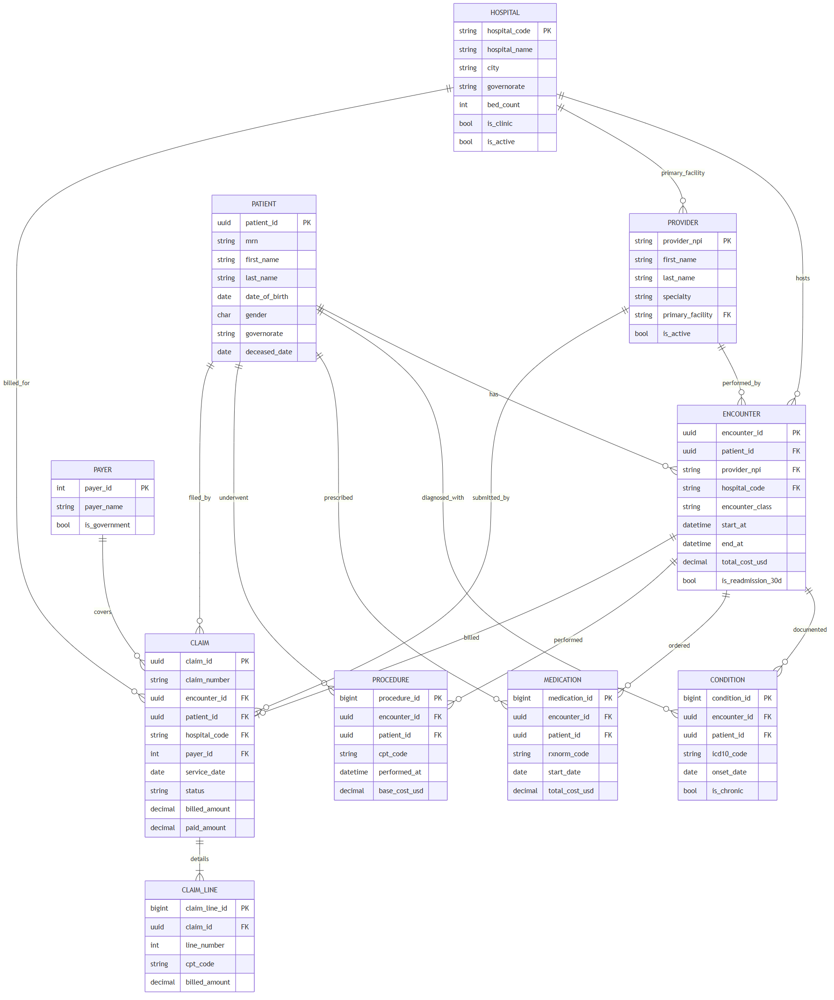
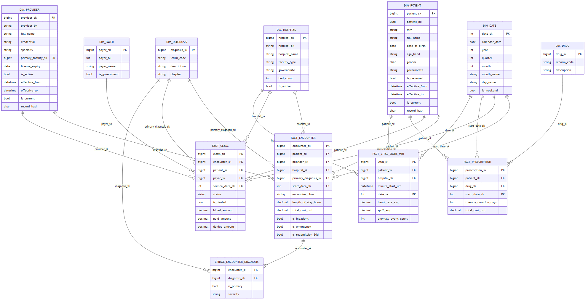

# Healthcare Data Warehouse & Analytics Platform — Final Report

**Team lead:** Mahmoud Ali AbdelMaksoud Salem
**Team:** Ahmed Gamal Lotfy Moussa · Hussein Elsayed Mohamady Gabr · John Emad Farhat · Mahmoud Abdelaziz Tolan · Reem Ashraf Said Abdelbary
**Programme:** DEPI — Digital Egypt Pioneers Initiative, Microsoft Data Engineer Track
**Group:** MNF4_AIS5_S1

---

## Abstract

This project delivers an end-to-end data-engineering platform for a fictional
Egyptian hospital network of 5 tertiary hospitals and 20 specialty clinics. It
consolidates scattered clinical records, insurance claims, pharmacy data and
real-time bedside vital signs into a governed **medallion** data warehouse
(Bronze → Silver → Gold), exposes a **star schema** with SCD Type 2 dimensions,
streams patient vitals with sub-minute anomaly detection, and surfaces the whole
model through a live **clinical intelligence dashboard**. The platform is
**deployed and running on Microsoft Azure** (Azure for Students), with the
enterprise-tier services of the original design substituted for budget
equivalents while preserving the architecture and the code. This report
documents the problem, the as-designed and as-deployed architectures, the data
model, the batch and streaming pipelines, the analytics, the BI layer, the
DevOps/CI-CD and security posture, the deployment, and the engineering lessons
learned.

**Live endpoints**

- Clinical dashboard (Streamlit): <https://hcdw-dashboard.jollysea-eb0cfa5c.westeurope.azurecontainerapps.io/>
- Provider API (Flask): <https://hcdw-provider-api.jollysea-eb0cfa5c.westeurope.azurecontainerapps.io/>

---

## 1. Problem statement

A network of 5 hospitals and 20 clinics across Egypt operates on a patchwork of
source systems: each hospital's EHR runs locally, claims come back from seven
different payers in a mix of CSV and XML, and bedside monitors expose only
vendor-specific dashboards. Clinical and operational leadership cannot answer
basic cross-network questions:

- What is our 30-day readmission rate, and which hospital is the outlier?
- Which payer denies the most claims, and how much revenue is at stake?
- Which patients carry the heaviest chronic-disease burden, and where?
- How many vital-sign alerts went unanswered last night?

The absence of a single, conformed analytical model means every question becomes
a bespoke, days-long data-gathering exercise. The goal of this project is to
build the platform that answers these questions from one governed warehouse, and
to stream patient vitals into a live view that surfaces anomalies inside 60
seconds.

### 1.1 Objectives

1. Ingest heterogeneous clinical, claims, pharmacy and IoT feeds into a
   governed lakehouse using the medallion pattern.
2. Model a conformed **star schema** suitable for clinical, operational and
   financial analytics, with slowly-changing patient and provider dimensions.
3. Enforce data quality with explicit rules and a quarantine path.
4. Provide a real-time path for bedside vitals with anomaly categorisation.
5. Expose the model through an interactive BI dashboard.
6. Engineer the whole thing like production software: tests, CI/CD, security
   scanning, containerisation, monitoring, and reproducible deployment.

### 1.2 Scope and data-privacy note

No real patient data is used at any point. All clinical data is synthesised with
**Synthea**; claims, providers and vital signs are produced by custom,
deterministic generators. Synthea's US demographics are re-mapped to Egyptian
governorates in the Silver layer, further detaching any residual real-world
signal. The platform demonstrates the governance patterns (column masking, RBAC,
audit logging, PII classification) a production healthcare system would require
without ever processing protected health information.

---

## 2. Architecture

### 2.1 As-designed (target) architecture

The platform follows the **medallion architecture** on Microsoft Azure:

| Layer | Purpose | Target service | Format |
|-------|---------|----------------|--------|
| Bronze (Raw) | Faithful copy of source feeds, append-only | Azure Data Lake Gen2 | Parquet |
| Silver (Validated) | Schema-enforced, deduplicated, DQ-quarantined | Databricks / PySpark | Delta Lake |
| Gold (Business) | Star schema, conformed dims + facts | Azure Synapse dedicated SQL pool | Relational |
| Speed layer | Real-time vitals + anomaly detection | Event Hubs + Spark Structured Streaming | Delta (append) |
| Orchestration | Nightly + hourly scheduling | Azure Data Factory | — |
| BI | Clinical/operational/financial dashboards | Power BI | — |

**Batch path:** Synthea CSV / claims JSONL / providers JSON → ADLS (Bronze) →
PySpark (Silver, Delta) → star-schema staging (Gold) → warehouse → BI.

**Stream path:** vitals simulator → Event Hubs → Spark Structured Streaming →
anomaly detection → warehouse `fact_vital_signs_minute` → dashboard.

### 2.2 As-deployed architecture (Azure for Students)

The graded artifact is deployed live on an **Azure for Students** subscription,
whose credit cannot fund Synapse (~$900/mo) or Databricks. Every enterprise
service was substituted for a budget equivalent **without changing the medallion
architecture or the star schema**:

| As designed | As deployed | Rationale |
|-------------|-------------|-----------|
| Synapse dedicated SQL pool | **Azure SQL Database (Basic)** | Same `dw` star schema; T-SQL DDL in `sql/ddl/azuresql/` |
| Databricks | **PySpark** (local / CI + `docker/Dockerfile.pipeline`) | Spark code unchanged |
| Azure Data Factory | Python loader scripts (`scripts/deploy_all.sh`) | Removes orchestration cost/complexity |
| Event Hubs + Spark Streaming | Event Hubs + lightweight Python consumer | Continuous Spark compute is the costly part |
| Power BI | **Streamlit** on Azure Container Apps | Power BI Pro is not free; Streamlit already in-repo |

The Spark medallion code (`pipelines/bronze|silver|gold`) is retained and runs
end-to-end in a Linux container as the *designed pipeline* artifact; the live
Azure SQL warehouse is populated by `pipelines/gold/seed_warehouse.py`, which
produces a fully cross-referenced star schema so every dashboard page and every
analytical query returns data. This design-vs-deployed split is documented in
`DEPLOYMENT.md` and surfaced in the README.

---

## 3. Data sources and generation

| # | Source | Generator | Format | Notes |
|---|--------|-----------|--------|-------|
| 1 | Patients, encounters, conditions, medications, procedures | **Synthea** | CSV | Realistic clinical histories; addresses remapped to Egypt in Silver |
| 2 | Insurance claims | `src/generators/generate_claims.py` | JSONL | 7 payers, ICD-10 codes, carrier-specific denial rates; seeded/deterministic |
| 3 | Provider registry | `src/generators/provider_api.py` (Flask) | JSON | 800 NPI-keyed providers with specialty + facility |
| 4 | Bedside vital signs (IoT) | `src/generators/simulate_vitals.py` | JSON stream | Per-device 1 Hz signals with baseline drift + injected anomalies |

The source operational (OLTP) model that feeds the Bronze layer is shown below.

*Figure 2 — OLTP source model: hospitals, patients, providers, encounters and
the clinical/claims tables that feed the medallion pipeline.*

All generators are **deterministic** given a seed (a hand-rolled seeded UUID
works around `uuid4`'s non-determinism), so datasets are reproducible. A shared
reference catalogue provides ICD-10, CPT, RxNorm and carrier vocabularies.

### 3.1 Exploratory data analysis

`notebooks/01_eda_synthea.ipynb` profiles the raw inputs with 20+ visualisations
(demographics, age pyramid, encounter-class mix, monthly encounter/condition
trends, encounter/medication cost distributions, a numeric-correlation heatmap,
top medications, conditions-per-patient, and claim status/denial-by-carrier)
plus an automated **ydata-profiling** report. The EDA findings seeded the
Silver-layer data-quality rules (null rates, referential integrity,
value-range checks).

---

## 4. Data model

The Gold layer is a **Kimball star schema**, shown below.

*Figure 1 — Gold star schema: conformed dimensions surrounding the encounter,
claim, prescription and vital-signs facts, with the encounter–diagnosis bridge.*

### 4.1 Dimensions

| Dimension | Grain | Type | Notes |
|-----------|-------|------|-------|
| `dim_date` | one calendar day | static | 1900–2030, populated by DDL |
| `dim_patient` | one patient version | **SCD Type 2** | age band, gender, governorate; history via effective_from/to |
| `dim_provider` | one provider version | **SCD Type 2** | specialty, credential, facility |
| `dim_hospital` | one facility | Type 1 | 5 hospitals + 20 clinics, with lat/lon |
| `dim_payer` | one payer | Type 1 | 7 carriers incl. a government insurer |
| `dim_diagnosis` | one ICD-10 code | Type 1 | chaptered per ICD-10-CM ranges |
| `dim_drug` | one RxNorm code | Type 1 | for prescription analytics |

### 4.2 Facts

| Fact | Grain | Key measures |
|------|-------|--------------|
| `fact_encounter` | one encounter | length of stay, base/total cost, coverage, readmission flag |
| `fact_claim` | one claim | billed / allowed / paid / denied, days-to-decision, status |
| `fact_prescription` | one prescription | dispenses, therapy duration, total cost |
| `fact_vital_signs_minute` | one device-minute | HR/SpO2/BP/temp aggregates, anomaly count |
| `bridge_encounter_diagnosis` | encounter × diagnosis | primary flag, severity (comorbidity modelling) |

Every fact foreign key resolves to a real dimension member; there are no
orphaned keys in the deployed warehouse (except `fact_claim.encounter_sk`, which
is intentionally nullable — see §5.2).

### 4.3 SCD Type 2 mechanics

`dim_patient` and `dim_provider` track history with `effective_from`,
`effective_to`, `is_current` and a `record_hash` (SHA-256 over the tracked
attribute set). A hash mismatch closes the current row and opens a new version.
Reporting views filter `is_current = 1`. The merge logic exists both as T-SQL
stored procedures (`sql/stored_procedures/sp_merge_dim_*_scd2.sql`) and,
for the deployed loader, as Python that applies the same close-then-insert
semantics.

---

## 5. Data pipeline

### 5.1 Batch (medallion)

- **Bronze** (`pipelines/bronze/bronze_ingest.py`): lands each source as-is in
  Snappy Parquet, partitioned by ingest date, carrying lineage metadata
  (`_ingest_ts`, `_source_file`, `_run_id`). Append-only and re-runnable.
- **Silver** (`pipelines/silver/*.py`): enforces explicit schemas on Delta,
  applies 16 DQ rules with a quarantine path, deduplicates by business key on
  latest ingest, remaps governorates, and derives flags (`age_band`,
  `is_readmission_30d`, `is_denied`, `days_to_decision`). All outputs overwrite,
  so the layer is idempotent.
- **Gold** (`pipelines/gold/`): stages conformed dimensions and facts with
  deterministic MD5 surrogate keys and loads them into the Azure SQL `dw` schema
  (`gold_to_sql.py`), or, for the live demo, builds the whole star schema
  directly (`seed_warehouse.py`).

### 5.2 Data quality

Quality is enforced at the Silver layer (full catalogue in
`docs/data_quality_report.md`). The rule engine splits each dataframe into
*clean* (rule TRUE) and *rejected* (FALSE/NULL) sets; rejected rows are tagged
with the failing rule and appended to a date-partitioned quarantine table.
Sixteen rules span patients (DOB present/plausible, gender valid), providers
(NPI present/10-digit, name present), encounters (id/patient/start present, end
after start, non-negative cost) and claims (bk present, status known, billed
non-negative, paid ≤ billed, decision after submission). Real claims arrive
detached from their encounter, so `fact_claim.encounter_sk` is deliberately
nullable and ~20% of claims are modelled as orphans; the orphan rate is tracked
by the Q12 data-quality monitor rather than rejected at insert time.

### 5.3 Streaming (speed layer)

The vitals simulator produces per-device 1 Hz signals to Azure Event Hubs; a
lightweight Python consumer aggregates to one-minute-per-device buckets,
categorises anomalies (tachycardia, bradycardia, hypoxia, hypertension, fever),
and upserts `dw.fact_vital_signs_minute`, which the dashboard's *Live Vital
Signs* page reads live. Roughly 5% of device-minutes flag at least one anomaly.
A Spark Structured Streaming implementation (`vitals_eventhub_to_sql.py`) is
retained as the *designed* speed-layer artifact.

---

## 6. Analytics and results

Twelve analytical SQL queries (`sql/queries/01..12`) cover clinical, operational
and financial questions; all twelve return data against the deployed warehouse.
Representative results (from a 2,000-patient / 6,000-encounter / 4,000-claim /
8,235-prescription seed):

- **Top network diagnosis:** essential hypertension (I10).
- **30-day readmission rate:** ~11–14% on inpatient discharges.
- **Claim denial rate:** ~10%, varying by payer from ~6% to ~11%.
- **Chronic disease burden (Q7):** 143 patient-cohort rows — patients carrying
  2+ chronic conditions, broken down by governorate, age band and gender.
- **Top drug spend (Q9):** insulin glargine and albuterol lead total spend,
  followed by atorvastatin and the antibiotics.

---

## 7. Business intelligence

The BI layer is a 7-page Streamlit *Clinical Intelligence Platform* deployed on
Azure Container Apps and reading the three `dw.vw_*` reporting views live from
Azure SQL:

1. **Home** — network KPIs and drill-down charts.
2. **Hospital Operations** — utilisation, length of stay, encounter mix.
3. **Revenue & Claims** — billed/paid/denied, denial by payer.
4. **Live Vital Signs** — streaming monitor with an alerts panel.
5. **Egypt Map** — geographic distribution across governorates.
6. **AI Assistant** — natural-language "ask the data", translating questions to
   guarded SELECT-only T-SQL via Azure OpenAI (`gpt-5-mini`).
7. **System Health** — ETL load-audit and freshness.

A full Power BI **design** deliverable (35 DAX measures, RLS roles, report
layout) is provided in `dashboards/powerbi/`; the Streamlit app is the graded,
deployed BI substitute.

---

## 8. DevOps, testing and security

- **CI/CD** (`.github/workflows/ci.yml`): seven jobs — Python lint, unit tests,
  Spark tests (JDK 17), dependency audit (pip-audit), SQL lint (sqlfluff),
  Docker build + **Trivy** image security scan, and markdown lint. The pipeline
  is green.
- **Tests:** 63 pytest cases across generators, the vitals simulator, the
  provider API, Silver Spark helpers, the Gold-to-SQL loaders, and SQL-file
  validation.
- **Container security:** CI builds and Trivy-scans the *actually-deployed*
  images (`Dockerfile.dashboard-db`, `Dockerfile.provider-api`). The scan
  surfaced 40 fixable CVEs (6 CRITICAL OS packages + a setuptools RCE); these
  were remediated at the source (`apt-get upgrade` + a system
  `pip/setuptools/wheel` upgrade), and the patched image was redeployed.
- **Containerisation:** dedicated images per service; the whole stack is
  scripted end-to-end in `scripts/deploy_all.sh`.
- **Observability:** structured JSON logging plus a `dw.load_audit` table that
  records every ETL run's row counts and status; a monitoring runbook lives in
  `docs/monitoring.md`.

---

## 9. Deployment

The platform runs on resource group `rg-healthcare-dw`:

| Resource | Name | Region | Notes |
|----------|------|--------|-------|
| Azure SQL Database | `healthcare` on `hcdw-sqlne-44ba4327` | North Europe | Basic tier; `dw` star schema + 3 views |
| Container Registry | `hcdwacr44ba4327` | West Europe | Basic |
| Container App — dashboard | `hcdw-dashboard` | West Europe | Streamlit, live on Azure SQL, scale-to-zero |
| Container App — provider API | `hcdw-provider-api` | West Europe | Flask |
| Container Apps — vitals | `hcdw-vitals-producer/consumer` | West Europe | Event Hubs stream |
| Event Hubs | `hcdw-eventhub-44ba4327` | North Europe | Kafka endpoint |
| Azure OpenAI | `hcdw-openai-44ba4327` | East US | `gpt-5-mini` for the AI assistant |

Because ACR Tasks are blocked on the student subscription, images are built
locally and pushed to ACR; Container Apps run at `min-replicas 0` (scale to
zero), keeping the monthly cost within the student credit. Full reproduce and
teardown steps are in `DEPLOYMENT.md`.

---

## 10. Data governance and privacy

No protected health information is ever processed. Governance patterns
demonstrated: column masking on `dim_patient.full_name`, role-based access at the
SQL layer, `dw.load_audit` for lineage/auditing, and the governorate remap that
detaches residual US demographic signal from Synthea. The AI assistant runs only
guarded, SELECT-only queries against the reporting views.

---

## 11. Challenges and solutions

1. **Enterprise services priced out.** Synapse and Databricks were unaffordable
   on student credit, so we substituted Azure SQL and PySpark while keeping the
   exact medallion architecture and star schema — and documented every
   substitution so the design remains legible.
2. **Blocked build tooling.** ACR Tasks are disabled on the student sub; images
   are built locally and pushed. When local Docker/disk pressure blocked large
   Spark image builds, the streaming consumer was run on a stock
   `python:3.11-slim` container with its script injected via an environment
   variable.
3. **Two loaders, one truth.** The Spark medallion path and the demo seeder use
   different surrogate-key schemes; rather than force them to interoperate, we
   designated `seed_warehouse.py` the live loader and the Spark path the
   *designed pipeline* artifact, and documented the choice.
4. **Security findings.** Adding a Trivy gate on the deployed images surfaced 40
   real, fixable CVEs; we fixed them at the source rather than silencing the
   scan.
5. **Verify before declaring blocked.** Several presumed blockers (a "red" CI
   lint, a NULL surrogate key, a "dark" AI page, a missing GitHub token scope)
   turned out to be false on inspection — a reminder to verify against the
   running system before accepting a limitation.

---

## 12. Lessons learned

- Architecture and discipline matter more than any single managed service — the
  same medallion design delivered value on a student budget.
- Design for determinism from day one; reproducible data made every downstream
  layer testable.
- Treat data quality as a first-class layer (rules + quarantine + a monitor),
  not an afterthought.
- Make CI scan and validate what you actually ship, not a proxy.

## 13. Future work

- Implement Silver→Gold modules for vitals, prescriptions and the diagnosis
  bridge in the Spark path so it can fully replace the seeder.
- Reconcile the provider key spaces so claims/encounters resolve to registered
  providers end-to-end in the Spark path.
- Build a Power BI `.pbix` from the existing DAX/design against the live Azure
  SQL model.
- Add durable checkpoints and a real alert sink (webhook/email) to the streaming
  consumer.

---

## Appendix A — Analytical query index

| # | Query | Consumer |
|---|-------|----------|
| Q1 | Top diagnoses by hospital | clinical leadership |
| Q2 | 30-day readmission rate | quality committee |
| Q3 | Average length of stay | operations |
| Q4 | Claim denial rate | revenue cycle |
| Q5 | Revenue per encounter | finance |
| Q6 | Emergency department throughput | operations |
| Q7 | Chronic disease burden (2+ conditions) | population health |
| Q8 | Provider productivity | medical staff office |
| Q9 | Top drugs by spend | pharmacy formulary |
| Q10 | Vital-sign anomalies | clinical monitoring |
| Q11 | Payer mix by governorate | contracting |
| Q12 | Orphan-claim data-quality monitor | data platform |

## Appendix B — Repository map

`src/` generators + Synthea · `pipelines/` bronze/silver/gold/streaming ·
`sql/` DDL + queries + procedures · `dashboards/` Streamlit + Power BI design ·
`docs/` architecture, data dictionary, DQ report, monitoring, this report,
presentation deck · `tests/` pytest suite · `docker/` images ·
`scripts/` deploy automation.

## Appendix C — Team contributions

All six members contributed across data generation, modelling, pipelines, BI and
DevOps under the DEPI Microsoft Data Engineer Track (Group MNF4_AIS5_S1).

---

*This report documents the platform as designed and as deployed. See
`DEPLOYMENT.md` for live endpoints, the full Azure resource inventory, cost, and
reproduce/teardown instructions.*
